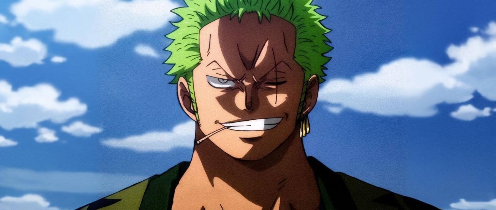
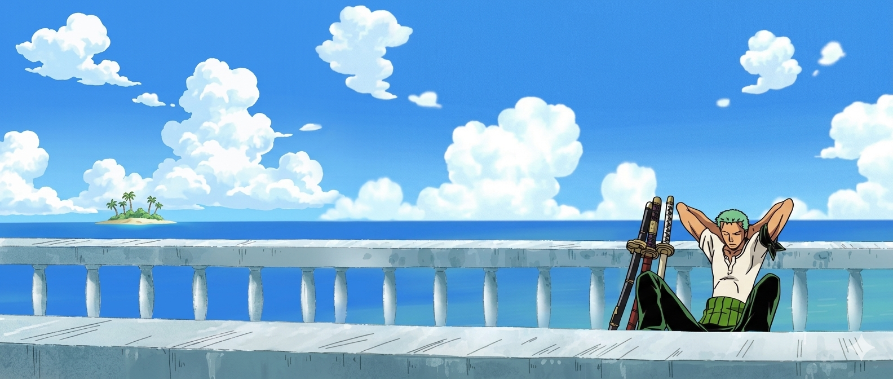

<div align="center">
  
</div>

<br/>
<p align="left">  </p>
<!-- ──────────────────────────────────────────────────────────
     NAME + TYPING ANIMATION
     Line 1 = your name (replace YOUR NAME HERE)
     Lines 2-3 = titles/taglines (edit freely)
     Font: Cinzel Decorative → gothic/sword-carved feel
     Color: C0C0C0 = steel silver, matches the blade palette
────────────────────────────────────────────────────────────── -->
<div align="center">
  
</div>

<div align="center">
  
</div>

<br/>

<div align="center">

<div align="center">

```
███████╗ █████╗ ███╗   ███╗██╗   ██╗███████╗██╗     
██╔════╝██╔══██╗████╗ ████║██║   ██║██╔════╝██║     
███████╗███████║██╔████╔██║██║   ██║█████╗  ██║     
╚════██║██╔══██║██║╚██╔╝██║██║   ██║██╔══╝  ██║     
███████║██║  ██║██║ ╚═╝ ██║╚██████╔╝███████╗███████╗
╚══════╝╚═╝  ╚═╝╚═╝     ╚═╝ ╚═════╝ ╚══════╝╚══════╝
   IDENTITY  :  Samuel Dharshi
   ALIAS     :  The Developer Who Never Gets Lost (he does)
   DOJO      :  LICET
   DOMAIN    :  AI • Web3 • Blockchain • Cybersecurity • Full Stack
   STATUS    :  Training. Always training.
```

</div>

---

<!-- ──────────────────────────────────────────────────────────
     ZORO QUOTE #1
     Source: Thriller Bark arc — said after absorbing all of
     Luffy's pain from Kuma. The most iconic Zoro moment.
     "Nothing happened." = zero drama, maximum weight.
────────────────────────────────────────────────────────────── -->
<div align="center">

> *"Nothing happened."*
>
> — **Roronoa Zoro**, Thriller Bark

</div>

---

<!-- ──────────────────────────────────────────────────────────
     CHARACTER CARD (JS object format)
     swords[] = Zoro's actual three blade names (Wado, Kitetsu, Enma)
     Edit: name, alias, dojo, vow, training[], currentArc, sideQuest
     Keep the cold, blunt tone — no exclamation marks, no hype words.
────────────────────────────────────────────────────────────── -->
## ⚔️ SANTORYU — THREE SWORD STYLE OF CODE

```javascript
const ZoroSango = {
  swords:    ["Wado Ichimonji", "Sandai Kitetsu", "Enma"],

  developer: {
    name:      "Samuel Dharshi",              
    alias:     "The One Who Never Gets Lost", 
    dojo:      "LICET",         
    vow:       "I will become the world's greatest.",
    training:  ["AI", "Blockchain", "DeFi", "Web3", "Cybersecurity", "Full Stack"],
  },

  currentArc:   "Conquering the New World of Code",  
  sideQuest:    "Building tools nobody asked for but everyone needs",
  funFact:      "Can hold three frameworks in his mouth simultaneously",
};
```

---

## 🗡️ ARSENAL — THE THREE BLADES
<!-- Blade 1: Core Languages (Wado = clean, pure, foundational) -->
<div align="center">
  <h3>⚔️ Wado Ichimonji — Core Languages</h3>

  
  
  
  
  
  
</div>

<!-- Blade 2: Full Stack (Kitetsu = cursed but devastating in the right hands) -->
<div align="center">
  <h3>🔪 Sandai Kitetsu — Full Stack (Cursed But Powerful)</h3>

  
  
</div>

<!-- Blade 3: AI & GenAI (Enma = highest ceiling, hardest to control) -->
<div align="center">
  <h3>⚡ Enma — AI & Generative AI (The Demon Blade)</h3>

  
  
  
</div>

<!-- Blade 4: Infrastructure (Haki = the invisible foundation) -->
<div align="center">
  <h3>🛡️ Haki — Tools & Infrastructure</h3>

  
  
  
</div>

---

<div align="center">

> *"I'll never lose again. I'll never be defeated again. I can't afford to be."*
>
> — **Roronoa Zoro**, Baratie Arc

</div>

---

<div align="center">
  
</div>

## 📊 BATTLE RECORDS — GITHUB STATS
 
<div align="center">
  
  
</div>

 
<div align="center">
  
</div>


🌐 Connect With Me
<p align="center">
  <a href="https://linkedin.com/in/samueldharshi/">
    
  </a>
  <a href="https://github.com/SamuelDharshi">
    
  </a>
  <a href="mailto:samueldharshi.27csb@licet.ac.in">
    
  </a>
</p>
<p align="center">
  
</p>

